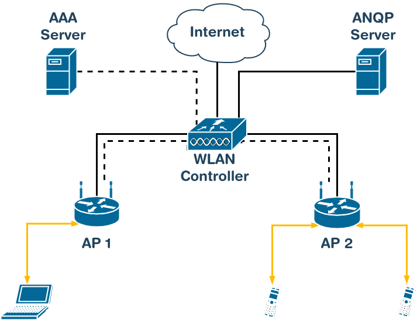

# Wi-FI Agile Multiband
                 

## O que é?

_Wi-Fi Agile Multiband_ é um conjunto de tecnologias que possibilitam um melhor uso dos recursos das redes Wi-Fi através de trocas de informações com outros dispositivos presentes na rede, direcionamento inteligente de clientes para access points, faixas de frequência e canais de acordo com o tráfego. Essa troca inteligente funciona como um balanceamento de carga entre os _APs_, evitando com que os clientes sofram devido à congestionamentos. Wi-FI Agile Multiband é uma parte do Wi-Fi CERTIFIED Vantage, que tem como objetivo melhorar a experiência do usuário em redes gerenciadas.  
    

  

## Topologia

A topologia pode variar de acordo com o ambiente e as necessidades. Por exemplo, em uma rede residencial o servidor AAA (Authentication, Authorization and Accounting) normalmente não é necessário, e o servidor ANQP (Access Network Query Protocol) é implementado no próprio AP, diferente de ambientes corporativos. Abaixo podemos ver uma topologia típica desse tipo de rede:

## E como funciona?

### Monitoramento dinâmico da rede

O primeiro passo, como dito acima, é trocar informações. Os _APs_ presentes na rede trocam dados com os clientes, afim de se obter informações como canais ou frequências em que o cliente prefere operar, outros _APs_ nas proximidades, qualidade do _link_ e etc. para que os _APs_ sejam classificados de acordo com as métricas citadas acima. Essas informações são obtidas através de requisições e respostas _Beacon_, que podem ser de três tipos:

- **Ativa:** O cliente envia requisições _Probe_ (de sondagem) num determinado canal esperando que os _APs_ que estiverem presentes neste canal respondam. Após receber as respostas, o cliente gera um relatório e envia para o _AP_ que solicitou através de uma requisição _Beacon_.
- **Passiva:** Aqui o cliente fica escutando o canal de forma passiva em um intervalo de tempo esperando respostas _Probe_. 
- **Tabela:** Nesse caso o cliente envia relatórios _Beacon_ com informações armazenadas em _cache_ que foram coletadas anteriormente. 

### Direcionamento inteligente

Quando um cliente deseja fazer uma troca, ele solicita um relatório de vizinhança ao _AP_ que ele está conectado. Esse relatório contém uma lista de possíveis _APs_ candidatos para a transição, cada um associado a um valor classificatório que está entre 0 e 255. Essa troca também pode ser feita sem que o cliente a solicite, seja por motivos de balanceamento de carga, força do sinal ou porque o _AP_ está prestes a desligar ou mudar de canal. 

### Transição rápida

Essa troca de _APs_ deve ser rápida para não prejudicar a experiência do usuário. A _Wi-Fi Agile Multiband_ utiliza o protocolo _IEEE 802.11r_ para permitir a autenticação rápida utilizando a segurança _WPA2_. Esse objetivo é atingido ao reutilizar as informações de segurança trocadas na associação inicial, dessa forma, ao realizar a transição o cliente não precisa negociar uma chave de segurança diferente com o novo _AP_. Já em redes corporativas elimina-se a necessidade do cliente reautenticar no servidor _RADIUS_ toda vez que troca de um _AP_ para outro.   

## Protocolos utilizados 

- **IEEE 802.11k:** Fornece informações sobre _APs_ vizinhos para o cliente para que ele tome decisões de conexão. 
- **IEEE 802.11v:** Aproveita as informações coletadas pelo protocolo anterior para direcionar um cliente para um _AP_, frequência ou canal diferente que irá oferecer uma melhor experiência para o usuário. Além disso, adiciona um serviço de gerenciamento de transição de _AP_ e de notificação de dispositivos na rede.
- **IEEE 802.11r:** Permite o cliente se reautenticar rapidamente quando realiza a troca de um _AP_ para outro.
- **IEEE 802.11u:** Habilita os protocolos _IEEE 802.11k_, _IEEE 802.11v_ e recursos definidos pela _Wi-Fi Alliance_ para serem utilizados com o _ANQP_.
- **recursos definidos pela _Wi-Fi Alliance_:** Inclui informações extras nos relatórios trocados pelos dispositivos além de adicionar melhorias no sistema de notificação definido pelo _IEEE 802.11v_ adicionando códigos de controle e _timeout_ para evitar notificações excessivas.